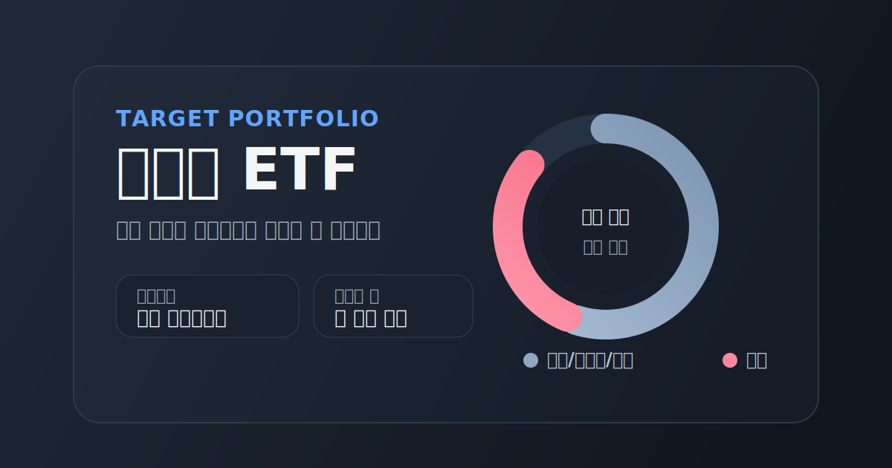
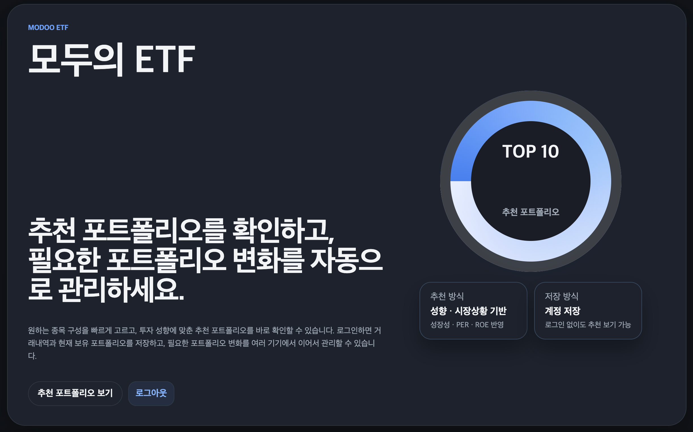
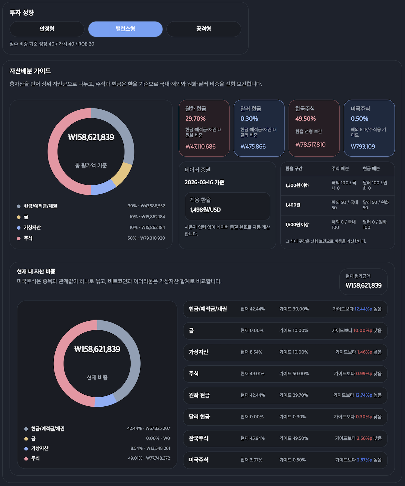
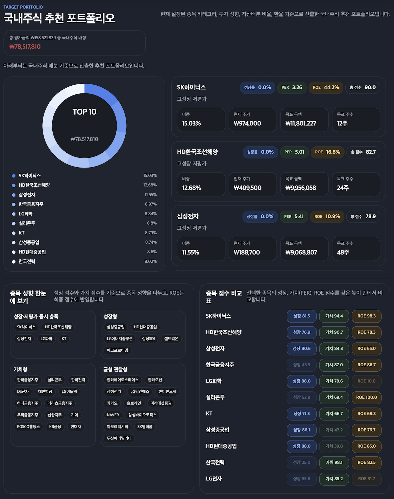
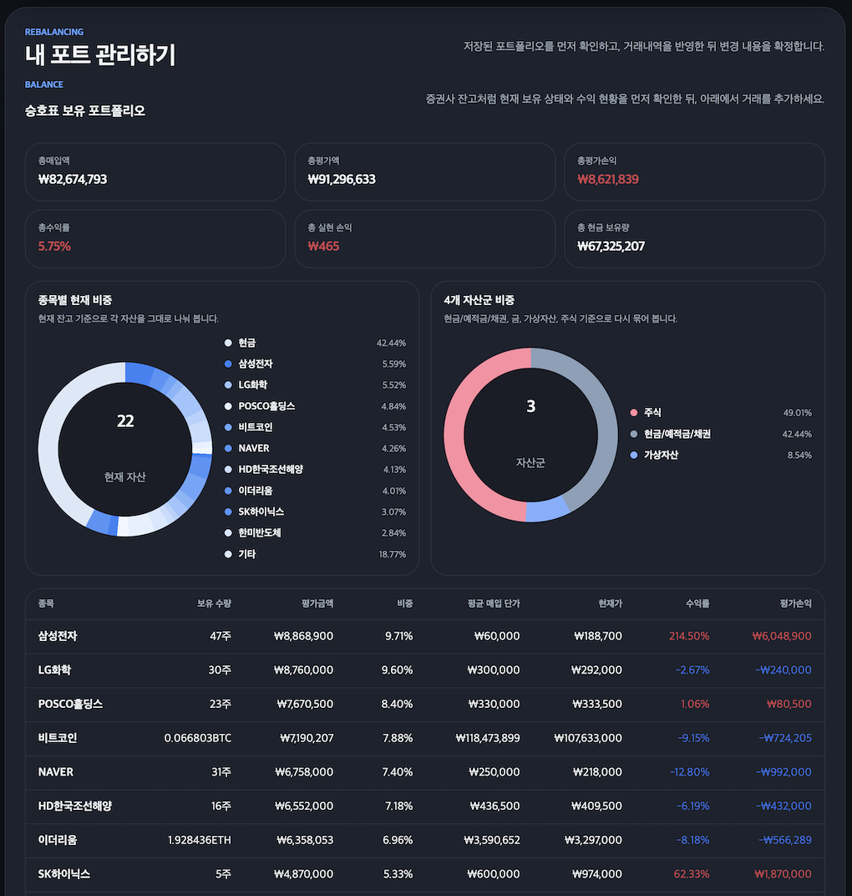
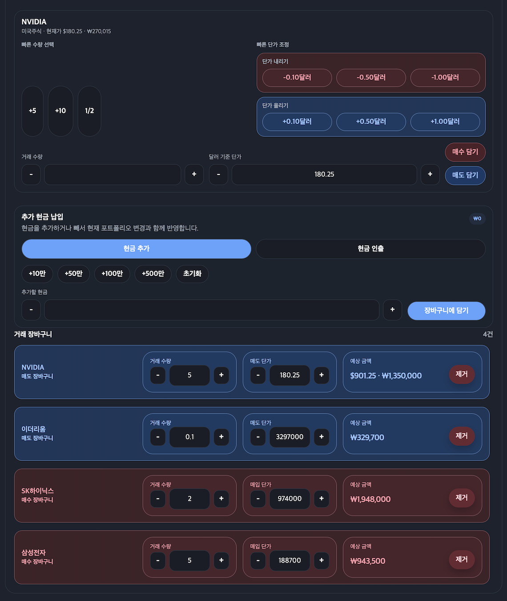
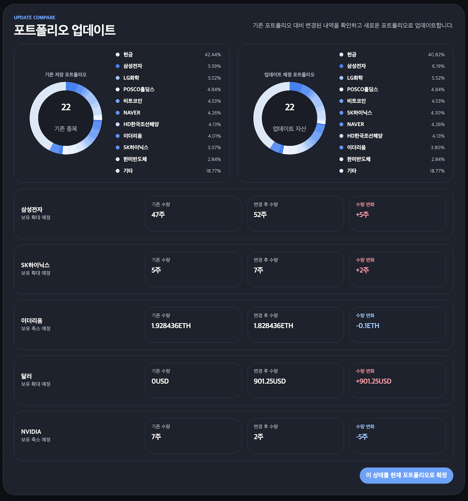
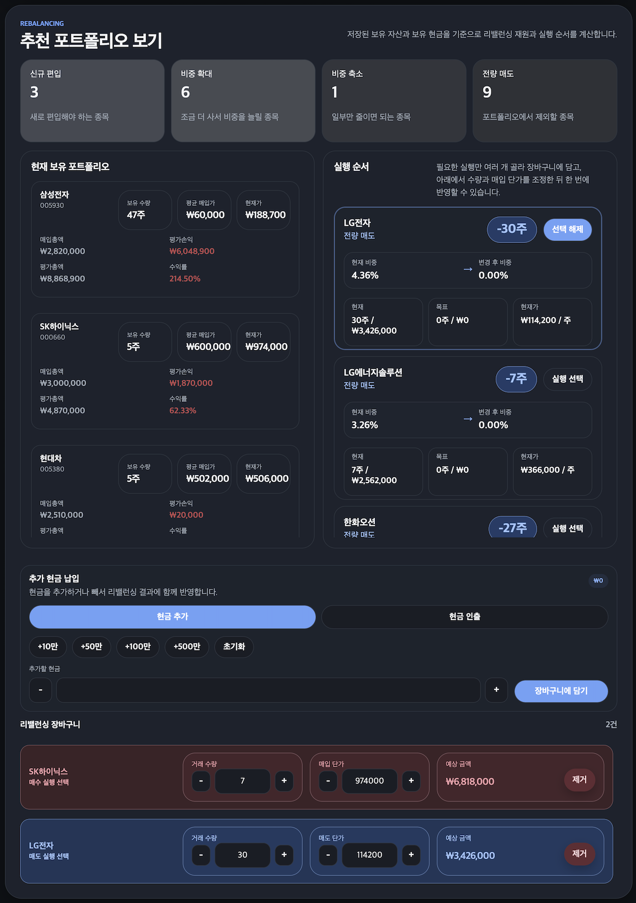

# 모두의 ETF

[](https://portfolio-rebalancer-alpha.vercel.app/)


[배포 링크 바로가기](https://portfolio-rebalancer-alpha.vercel.app/) · [GitHub Actions 데이터 갱신 워크플로](https://github.com/Leesuh1/portfolio-rebalancer/actions)



투자 성향, 자산배분, 추천 포트폴리오, 실제 보유 포트 관리까지 하나의 흐름으로 연결한 자산배분 기반 포트폴리오 관리 웹앱입니다.  
추천 포트폴리오를 확인하는 데서 끝나지 않고, 로그인 후에는 보유 자산을 저장하고 `거래 입력 → 장바구니 → 비교 → 확정` 흐름으로 포트폴리오를 업데이트하거나 리밸런싱할 수 있도록 구성했습니다.

## 바로 보기

- 배포 주소: [https://portfolio-rebalancer-alpha.vercel.app/](https://portfolio-rebalancer-alpha.vercel.app/)
- 로그인 전: 추천 포트폴리오와 자산배분 가이드를 중심으로 확인 가능
- 로그인 후: 포트폴리오 저장, 거래 입력, 장바구니, 업데이트 비교, 리밸런싱까지 사용 가능

## 화면 미리보기

- 랜딩: 추천 포트폴리오, 추천 방식, 저장 방식을 첫 화면에서 한 번에 확인
- 자산배분 가이드: 투자 성향, 환율, 총 평가금액 기준 자산 배분, 내 현재 자산 비중을 함께 비교
- 국내주식 추천 포트폴리오: 상위 10개 추천 종목과 점수, 목표 비중, 목표 금액, 목표 주수를 제공
- 내 포트 관리하기: 종목별 현재 비중, 자산군 비중, 손익 현황, 저장된 포트 관리 기능 제공
- 거래 입력 / 장바구니: 국내주식과 멀티자산 거래를 장바구니에 담고 단가를 조정한 뒤 확정
- 포트폴리오 업데이트 / 리밸런싱 비교: 변경 전후 도넛 차트, 수량 변화, 실행 순서를 비교 후 확정

### 랜딩



### 투자 성향 / 자산배분 가이드



### 국내주식 추천 포트폴리오 / 종목 분석



### 내 포트 관리하기



### 거래 입력 / 장바구니



### 포트폴리오 업데이트 비교



### 추천 포트폴리오 기반 리밸런싱 실행



## 프로젝트 목적

- 추천 포트폴리오 확인과 실제 포트 관리 경험을 한 서비스 안에서 자연스럽게 연결
- 투자 성향과 환율, 자산배분 기준을 함께 반영해 국내주식 추천 포트폴리오 산출
- 저장 전 비교 중심 UX로 사용자가 변경 내용을 충분히 이해한 뒤 확정하도록 설계
- 국내주식뿐 아니라 달러, 금(GLD), 가상자산, 미국주식까지 고려할 수 있는 멀티자산 구조로 확장

## 주요 화면

### 1. 랜딩 / 추천 진입 화면

- 비로그인 상태에서는 추천 포트폴리오 중심 랜딩만 노출
- `모두의 ETF` 소개, 추천 방식, 저장 방식, 추천 포트폴리오 보기 CTA를 한 화면에 배치
- 도넛 차트로 추천 포트의 상위 종목 비중을 직관적으로 보여줌

### 2. 투자 성향 + 자산배분 가이드

- 투자 성향을 `안정형 / 밸런스형 / 공격형`으로 구분
- 총 평가금액 기준으로 상위 자산군 비중을 도넛 차트로 시각화
- 하위 자산군은 `원화 현금 / 달러 현금 / 한국주식 / 미국주식`으로 분리해 상세 가이드 제공
- 환율 구간별 선형 보간 규칙을 함께 보여줘 국내/해외, 원화/달러 비중 조정 기준을 설명
- 로그인 사용자는 같은 영역 아래에서 현재 자신의 자산 비중과 가이드 대비 차이까지 확인 가능

### 3. 국내주식 추천 포트폴리오

- 선택한 종목 카테고리, 투자 성향, 자산배분 비율, 환율을 반영해 국내주식 추천 포트폴리오 산출
- 도넛 차트와 상위 종목 리스트를 함께 제공
- 각 추천 종목별로 비중, 현재 주가, 목표 금액, 목표 주수를 카드 형태로 표시
- 종목 성향 분류와 성장/가치/PER/ROE 점수 비교 UI를 통해 추천 근거를 함께 전달

### 4. 종목 카테고리 / 검색

- 기본 관심 종목, 코스피 대표, 코스닥 대표, 전체 해제 등 카테고리 선택 기능 제공
- 선택한 종목은 칩 형태로 관리하고, 화면에는 상위 검색 결과만 정리해 노출
- 종목 검색과 선택 구조를 단순화해 대규모 종목 목록도 빠르게 다룰 수 있도록 구성

### 5. 내 포트 관리하기

- 로그인 사용자는 계정 단위로 포트폴리오를 저장, 복사, 삭제 가능
- 신규 포트폴리오 생성 시 이름과 투자가능금액을 설정
- 저장된 포트는 총매입액, 총평가액, 총평가손익, 총수익률, 총 현금 보유량을 요약 카드로 확인 가능
- 보유 종목 기준 도넛 차트와 4개 자산군 도넛 차트를 함께 제공해 현재 상태를 두 관점에서 파악할 수 있도록 구성

### 6. 거래 입력 / 장바구니

- 보유 포트폴리오를 먼저 확인한 뒤 아래에서 매수/매도 거래를 입력
- 국내주식, 달러, 금(GLD), 비트코인, 이더리움, 미국주식까지 같은 흐름 안에서 지원
- 미국주식과 GLD는 달러 기준 단가로 입력
- 장바구니에서는 사용자가 입력한 수량과 단가를 그대로 유지하고, 확정 시점에만 내부 저장용 원화 단가로 변환
- 현금 추가/인출도 장바구니와 함께 반영 가능

### 7. 포트폴리오 업데이트 비교

- 현재 저장 포트와 업데이트 예정 포트를 나란히 비교
- 전/후 도넛 차트, 상위 종목 비중, 종목별 수량 변화, 자산 변화 카드를 함께 제공
- 저장 전에는 실제 포트가 바뀌지 않고, 비교 후 확정 시점에만 반영

### 8. 리밸런싱 실행 순서

- 저장된 보유 자산과 보유 현금을 기준으로 리밸런싱 재원과 실행 순서를 계산
- `신규 편입 / 비중 확대 / 비중 축소 / 전량 매도` 요약 카드 제공
- 실행할 항목을 선택해 장바구니에 담고, 매입/매도 단가를 조정한 뒤 한 번에 확정 가능
- 실행 순서는 국내주식 중심으로 정리해, 실제 리밸런싱 판단에 필요한 정보만 남김

## 핵심 기능

- 로그인 전/후 사용자 경험 분리
- 투자 성향 기반 자산배분 가이드
- 국내주식 추천 포트폴리오 생성
- 포트폴리오 저장 / 복사 / 삭제
- 거래 입력 → 장바구니 → 비교 → 확정 흐름 통일
- 리밸런싱 전후 포트폴리오 비교
- 멀티자산 지원
  - 달러
  - 금(GLD)
  - 비트코인
  - 이더리움
  - 미국주식 Top 10
- 라이트/다크 모드 대응
- 로그인 상태 초기화 및 안전한 저장 흐름 유지

## 프로젝트에서 집중한 점

### 1. 복잡한 기능을 한 번에 이해할 수 있는 구조로 정리

- 추천 보기와 실제 포트 관리 경험이 따로 놀지 않도록 하나의 흐름으로 연결
- 로그인 전에는 추천 전용, 로그인 후에는 저장/업데이트/리밸런싱 가능 구조로 분기
- 같은 기능이면 업데이트와 리밸런싱의 UX 패턴을 최대한 통일

### 2. 저장 전 비교 중심 UX

- 거래를 입력해도 즉시 저장 결과에 반영하지 않음
- 항상 `장바구니 → 비교 → 확정` 순서로 사용자가 변경 내용을 먼저 이해하도록 설계

### 3. 실제 투자 흐름에 가까운 자산 처리

- 미국주식과 GLD는 달러 기준으로 입력
- 달러, 비트코인, 이더리움은 소수 수량을 허용
- 미국자산과 달러 원가를 분리해, 환차손익과 자산 손익이 뒤섞이지 않도록 lot 구조 정리
- 매도 시 lot은 LIFO 기준으로 계산

### 4. 데이터 실패 상황까지 고려한 운영 안정성

- 국내주식 추천 데이터는 배치 스냅샷으로 생성
- 해외/멀티자산 데이터는 서버 fetch로 갱신하되, 실패 시 마지막 성공 스냅샷을 fallback으로 사용
- GitHub Actions 권한, 외부 시세 실패, 배포 환경변수 등 운영 이슈까지 점검해 안정적으로 유지

## 데이터 갱신 구조

### 국내주식 추천 데이터

- `portfolio_dashboard.py`가 추천 데이터와 스냅샷 파일을 생성
- GitHub Actions가 정해진 시간에 `web/public/data/dashboard_data.json`을 갱신
- 현재 스케줄:
  - 한국시간 오후 4시
  - 한국시간 오전 8시 30분

### 해외 / 멀티자산 데이터

- 대상:
  - 환율
  - 달러
  - GLD
  - 비트코인
  - 이더리움
  - 미국주식 Top 10
- Next.js 서버에서 외부 데이터를 fetch
- fetch 실패 시 마지막 성공 스냅샷 값을 유지하도록 fallback 처리

## 기술 스택

- Frontend: Next.js 15, React 19, TypeScript
- Auth / Storage: Supabase
- Data Snapshot: Python
- Automation: GitHub Actions
- Deployment: Vercel

## 디렉터리 구조

```text
portfolio/
├─ portfolio_dashboard.py
├─ outputs/
├─ supabase/
├─ web/
│  ├─ app/
│  ├─ components/
│  ├─ lib/
│  ├─ public/data/
│  └─ package.json
└─ .github/workflows/
```

## 로컬 실행

### 1. 웹 앱 실행

```bash
cd /Users/seunghosmacbook/Desktop/my_project/portfolio/web
source ~/.nvm/nvm.sh && nvm use default >/dev/null
npm install
npm run dev
```

### 2. 프로덕션 빌드 확인

```bash
cd /Users/seunghosmacbook/Desktop/my_project/portfolio/web
source ~/.nvm/nvm.sh && nvm use default >/dev/null
npm run build
npm run start
```

### 3. 국내주식 스냅샷 생성

```bash
cd /Users/seunghosmacbook/Desktop/my_project/portfolio
python3 -m venv .venv
source .venv/bin/activate
pip install -r requirements.txt
python portfolio_dashboard.py
```

## 환경 변수

웹 로그인 기능을 사용하려면 `web/.env.local`에 Supabase 환경 변수를 설정해야 합니다.

```bash
NEXT_PUBLIC_SUPABASE_URL=...
NEXT_PUBLIC_SUPABASE_PUBLISHABLE_KEY=...
```

## 배포

- 웹 앱: Vercel
- 국내주식 데이터 스냅샷: GitHub Actions
- 링크 공유 미리보기: Open Graph 메타태그 및 OG 이미지 적용

## 이 프로젝트에서 보여주고 싶은 역량

- 여러 요구사항이 섞인 기능을 사용자가 이해하기 쉬운 단계로 구조화하는 능력
- 투자/환율/멀티자산 로직을 실제 흐름에 맞게 정리하는 도메인 해석 능력
- 장바구니, 비교, 확정 중심 UX를 끝까지 다듬는 세밀함
- GitHub Actions, Vercel, fallback 데이터 구조까지 포함한 운영 안정성 고려

## 참고

- 제출용 README는 실제 구현 화면을 기준으로 기능과 사용자 흐름을 설명하도록 구성했습니다.
- 스크린샷 이미지를 저장소에 추가하면, README에 실제 화면 이미지를 더 풍부하게 연결할 수 있습니다.
